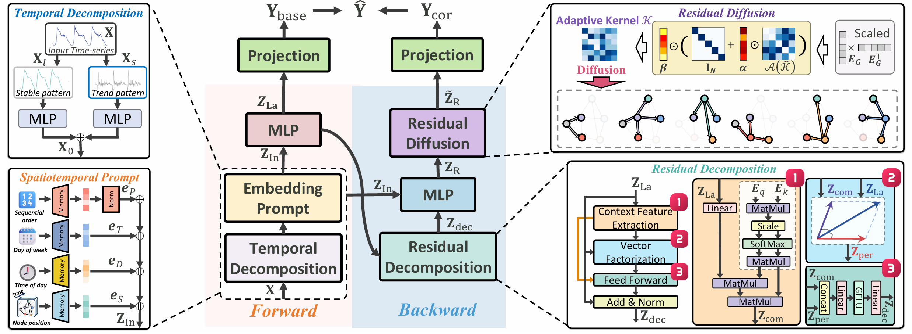

# BiST: A Lightweight and Efficient Bi-directional Model for Spatiotemporal Prediction (VLDB 2025)
This is the official repository of our VLDB 2025 paper. This paper introduces BiST, a lightweight yet effective **Bi**-directional **S**patio-**T**emporal prediction model based on an MLP architecture, achieving competitive predictive performance while maintaining low computational complexity and memory usage. This model effectively captures inconsistencies between label and input information to enhance performance. We propose a novel spatiotemporal decoupling module that decomposes spatiotemporal features into node-shared context features and node-specific features. We evaluate the effectiveness of the model on over a dozen datasets, including large-spatial-scale and long-period datasets. Experimental results demonstrate the effectiveness, high training efficiency, and low memory burden of our model.



## 1. Introduction about the datasets
### 1.1 Generating the sub-datasets from LargeST
In the experiments of our paper, we used all subdatasets of LargeST from 2017 to 2021, which were generated from CA dataset, followed by [LargeST](https://github.com/liuxu77/LargeST/blob/main). For example, you can download CA dataset from the provided [link](https://www.kaggle.com/datasets/liuxu77/largest) and please place the downloaded `archive.zip` file in the `data/ca` folder and unzip the file. 

First of all, you should go through a jupyter notebook `process_ca_his.ipynb` in the folder `data/ca` to process and generate a cleaned version of the flow data. Then, please go through all the cells in the provided jupyter notebooks `generate_SUBDATASET-NAME_dataset.ipynb` in the folder `data/SUBDATASET-NAME`. Finally use the commands below to generate traffic flow data for our experiments. 
```
python data/generate_data_for_training.py --dataset SUBDATASET-NAME --years 2017_2018_2019_2020_2021
```
Moreover, you can also generate the any other years of data, such as the year `2019` as traditional experiment. 

### 1.2 Generating XTraffic
We also implement experiments on [XTraffic](https://xaitraffic.github.io/). For example, you can download XTraffic dataset from the provided [link](https://www.kaggle.com/datasets/gpxlcj/xtraffic) and please place the downloaded `p0X_dne.npy` for X is from `0` to `12` file in the `data/XTraffic` folder.

You should go through the jupyter notebook `process_xtraffic_his.ipynb` in the folder `data/XTraffic` to process and generate a cleaned version of the flow data. Finally use the commands below to generate traffic flow data for our experiments. 
```
python data/XTraffic/generate_data_for_XTraffic.py
```

### 1.3 Generating XXLTraffic
We implement extra experiments on [XXLTraffic](https://github.com/cruiseresearchgroup/XXLTraffic). For example, you can download Knowair dataset from the provided [link](https://github.com/cruiseresearchgroup/XXLTraffic/blob/main/data/pems05.zip) and please place the downloaded `pems05.zip` file in the `data/XXLTraffic` folder and unzip the file.

You should go through the jupyter notebook `process_data.ipynb` in the folder `data/XXLTraffic` to process and generate a cleaned version of the flow data. Finally use the commands below to generate traffic flow data for our experiments. 
```
python data/XXLTraffic/generate_data_for_training.py
```

<br>

## 2. Environmental Requirments
The experiment requires the same environment as [LargeST](https://github.com/liuxu77/LargeST/blob/main), and need to add the libraries mentioned in the requirements in [Knowair](https://github.com/shuowang-ai/PM2.5-GNN).


<br>

## 📄 Citation

If you find this project helpful, please cite us:

```bibtex
@article{ma2025bist,
  title={BiST: A Lightweight and Efficient Bi-directional Model for Spatiotemporal Prediction},
  author={Ma, Jiaming and Wang, Binwu and Wang, Pengkun and Zhou, Zhengyang and Wang, Xu and Wang, Yang},
  journal={Proceedings of the VLDB Endowment},
  volume={18},
  number={6},
  pages={1663--1676},
  year={2025},
  publisher={VLDB Endowment}
}
```
