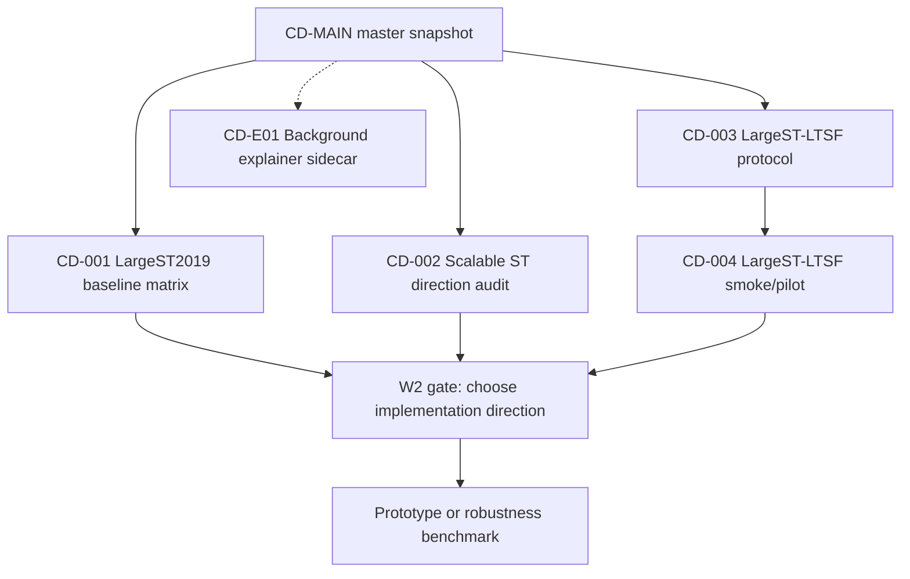

# Branch Map: LargeST 2019 Scalable ST Forecasting

Snapshot: `snap-2026-06-24-001`
Owner session: `[CD-MAIN][master] LargeST2019 scalable ST`
Artifact root: `SpatialTemporalGraph/mvp_experiments/active/largest2019_scalable_st`

## Global Decisions

- This root is the new artifact home for the master session and future conductor branches.
- The older `largest2019_virtual_node` root is preserved as historical input; do not delete or overwrite it during this migration.
- Dynamic-threshold experiments are out of scope for this line unless the master session explicitly reopens them.
- Wave 1 is split into two clean tracks: one experiment branch and one research branch.
- Branch sessions must write branch briefs and completion reports under this root after user confirmation.
- LargeST-LTSF input-window probing is tracked under `ltsf_input_window`, separate from the 12-to-12 baseline matrix.

## Wave Plan

| Wave | Branches | Prerequisites | Gate |
|---|---|---|---|
| W0 | master folder and registry setup | user approved new root | user confirms branch cards |
| W1 | `CD-001`, `CD-002`, `CD-003`, `CD-004` | current master snapshot | completion reports reviewed |
| W2 | prototype, robustness benchmark, or LargeST-LTSF full run | W1 reports and master decision | explicit user approval |

## Today View

Active now:

- `CD-001` LargeST2019 baseline matrix - experiment branch - agent `Bernoulli` / `019ef7cc-ba7a-7101-9499-7dfeff3d4f13`
- `CD-002` Scalable ST direction audit - research branch - agent `Nash` / `019ef7cc-bbbd-7922-b73c-65b59ec7ffa4`
- `CD-003` LargeST-LTSF complexity and protocol - research branch - tooling/report ready in this workspace
- `CD-004` LargeST-LTSF smoke and pilot - experiment branch - tooling ready, experiments not yet launched

Planned, not opened:

- `CD-E01` Background questions - explainer sidecar

Merge pending:

- none

Historical inputs:

- `../largest2019_virtual_node/conductor/CD-001_largest2019_baselines/completion-report.md`
- `../largest2019_virtual_node/conductor/CD-002_virtual_node_bipartite/completion-report.md`
- `../largest2019_virtual_node/conductor/CD-E01_bist_paper_explainer/reading-notes.md`

## Branch Registry

| ID | Stable title | Type | Role | State | Wave | Brief | Completion report |
|---|---|---|---|---|---|---|---|
| `CD-001` | `[CD-001][W1][experiment] LargeST2019 baseline matrix` | branch | experiment | active | W1 | `CD-001_largest2019_baseline_matrix/branch-brief.md` | `CD-001_largest2019_baseline_matrix/completion-report.md` |
| `CD-002` | `[CD-002][W1][research] Scalable ST direction audit` | branch | research | active | W1 | `CD-002_scalable_st_direction_audit/branch-brief.md` | `CD-002_scalable_st_direction_audit/completion-report.md` |
| `CD-003` | `[CD-003][W1][research] LargeST-LTSF complexity and protocol` | branch | research | report_ready | W1 | `CD-003_largest_ltsf_complexity_protocol/branch-brief.md` | `CD-003_largest_ltsf_complexity_protocol/completion-report.md` |
| `CD-004` | `[CD-004][W1][experiment] LargeST-LTSF smoke and pilot` | branch | experiment | brief_ready | W1 | `CD-004_largest_ltsf_smoke_pilot/branch-brief.md` | `CD-004_largest_ltsf_smoke_pilot/completion-report.md` |
| `CD-E01` | `[CD-E01][sidecar][explainer] Background questions` | explainer | explainer | planned | Sidecar | `CD-E01_background_questions/branch-brief.md` | `CD-E01_background_questions/completion-report.md` |

## Dependency Graph

## Branch Cards

### CD-001

- Stable title: `[CD-001][W1][experiment] LargeST2019 baseline matrix`
- Type / role: `branch / experiment`
- Purpose: complete and organize LargeST 2019 results for STID, PatchSTG, BiST, and MAGE.
- Why it exists: the master needs one clean baseline matrix before judging any new scalable ST method.
- Dependency / wave: W1, ready after user confirms branch cards.
- Allowed context: `SpatialTemporalGraph`, 178/180 logs and checkpoints, BasicTS/PatchSTG/BiST/MAGE configs and result files.
- Expected artifact: completion report plus unified result table.
- Completion criteria: SD/GLA/GBA result matrix is complete or missing cells are explicitly justified; metric convention, train time, memory, and code/config deviations are recorded.
- Return condition: master can use the table as the baseline coordinate system.
- Open now: wait for user confirmation.

### CD-002

- Stable title: `[CD-002][W1][research] Scalable ST direction audit`
- Type / role: `branch / research`
- Purpose: audit candidate research directions around virtual nodes, bipartite bottlenecks, patch/expert scaling, and Robust-LargeST.
- Why it exists: the master needs a novelty and positioning decision before implementation.
- Dependency / wave: W1, can run in parallel with CD-001 but should incorporate CD-001's final table before final recommendation.
- Allowed context: Zotero, web literature, old CD-002 virtual-node report, SensorFault/Robust-LargeST notes, PatchSTG/MAGE/BiST/STID papers.
- Expected artifact: completion report with literature table, method taxonomy, novelty risks, and W2 recommendation.
- Completion criteria: gives a `go / hold / drop` decision for each candidate direction and identifies required baselines.
- Return condition: master can decide whether W2 is a virtual-node prototype, robustness benchmark, or a different direction.
- Open now: wait for user confirmation.

### CD-003

- Stable title: `[CD-003][W1][research] LargeST-LTSF complexity and protocol`
- Type / role: `branch / research`
- Purpose: define complexity triage and an exact LTSF protocol for varying input windows on LargeST 2019.
- Why it exists: the master needs to know whether long input windows are worth testing before spending GPU time.
- Dependency / wave: W1, ready from current master snapshot.
- Allowed context: FaST paper setting, STID/BiST/BasicTS LTSF code, LargeST 2019 metadata.
- Expected artifact: resource estimate table, protocol notes, and model scalability classification.
- Completion criteria: resource estimator runs; smoke/pilot matrix is explicit.
- Return condition: CD-004 can launch without changing baseline configs.
- Open now: tooling/report already written in workspace.

### CD-004

- Stable title: `[CD-004][W1][experiment] LargeST-LTSF smoke and pilot`
- Type / role: `branch / experiment`
- Purpose: run SD smoke/pilot and selected GBA scalable-model jobs for `H=672` and varying input length.
- Why it exists: the master needs empirical curves for input-window length versus accuracy/cost.
- Dependency / wave: W1, depends on CD-003 protocol.
- Allowed context: `ltsf_input_window` scripts, BasicTS datasets/configs, LargeST/BiST cache format, 178/180 GPU servers.
- Expected artifact: summary CSV, MAE/RMSE curves, logs, sampled GPU memory, and clear missing/OOM cells.
- Completion criteria: SD smoke succeeds or failures are diagnosed; pilot summary is generated for completed cells.
- Return condition: master can decide whether to run full 50-epoch LargeST-LTSF experiments.
- Open now: tooling ready; remote launch still requires server data/GPU preflight.
