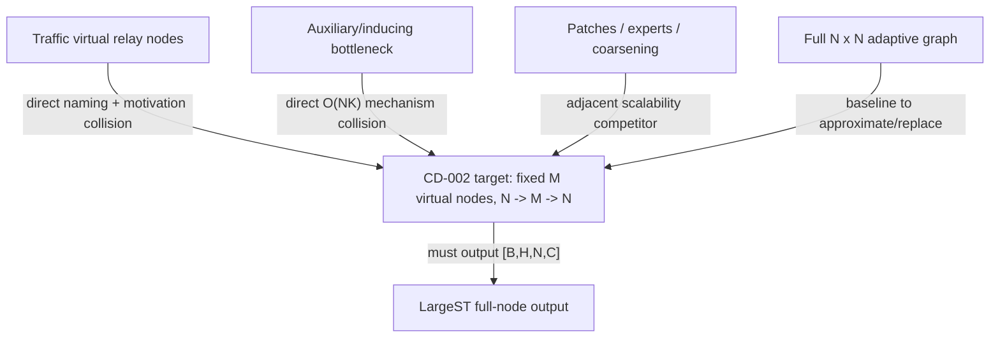

# CD-002 Completion Report: Virtual-Node Bipartite Graph

Branch status: DONE_WITH_CONCERNS

Recommendation: go with constraints

Date: 2026-06-22

Scope followed: research/report only. No repo code or experiment configs were modified.

## Decision Summary

The direction is worth a W2 prototype, but only with a narrow claim. The broad idea is not novel: traffic virtual nodes and auxiliary-node bipartite forecasting already exist. The defensible version is:

> a LargeST-compatible full-node forecaster that uses a fixed small set of geography-aware, sparsely assigned virtual nodes as an `N -> M -> N` global communication bottleneck, optionally combined with a local physical/adaptive graph branch.

Do not claim novelty for "virtual nodes for traffic" or "bipartite auxiliary nodes." Claim only LargeST-scale, sparse/geography-aware implementation value if results support it.

## Literature Table

| Work | Mechanism | Complexity / scaling | Relationship to target | Collision level |
|---|---|---|---|---|
| [Virtual Nodes Improve Long-term Traffic Prediction](https://arxiv.org/abs/2501.10048), 2025 | Adds virtual nodes to traffic graph with semi-adaptive distance/adaptive adjacency to improve long-range traffic prediction | Virtual-node edges add relay capacity; not framed as the exact fixed `N x M` inducing bottleneck | Direct traffic virtual-node precedent | Direct collision on naming and motivation |
| [Multivariate Time Series Forecasting with Latent Graph Inference](https://arxiv.org/abs/2203.03423), 2022 | Infers graph relations; offers bipartite communication through `K` auxiliary nodes | Explicitly reduces graph inference from `O(N^2)` to `O(NK)` | Direct auxiliary-node bipartite forecasting precedent | Direct collision on mechanism |
| [Set Transformer](https://arxiv.org/abs/1810.00825), 2018 | Inducing points reduce set attention cost | Induced attention reduces quadratic set attention toward linear in set size for fixed inducing count | Foundational inducing-point analogy | Inspiration |
| [Perceiver](https://arxiv.org/abs/2103.03206) / [Perceiver IO](https://arxiv.org/abs/2107.14795), 2021 | Cross-attends many inputs into a small latent array; IO queries latents for structured outputs | Scales linearly with input/output size via latent bottleneck | Strong `N -> M -> N` architectural analogy | Inspiration, but reviewers may call it Perceiver-for-sensors |
| [PatchSTG](https://arxiv.org/abs/2412.09972), 2024 | KDTree irregular spatial patches with depth/breadth attention | Reports up to `10x` train speed and `4x` memory improvement | Closest large-scale geography-aware traffic scalability neighbor | Strong adjacent competitor |
| [MAGE](https://openreview.net/forum?id=jCGwSLwOt9), NeurIPS 2025 poster | Sparse balanced mixture-of-experts for linear adaptive graph learning | Claims linear complexity in nodes | Closest linear adaptive-graph competitor | Strong adjacent competitor |
| [MegaCRN](https://arxiv.org/abs/2212.05989), 2022 | Meta-node bank supports meta-graph learning for non-stationary ST data | Compact memory/meta nodes condition graph learning | Relevant "node bank" analogy | Moderate collision |
| [Graph WaveNet](https://arxiv.org/abs/1906.00121), 2019 | Adaptive dependency matrix from node embeddings plus temporal convolutions | Dense adaptive graph can be `O(N^2)` if materialized | Foundational adaptive-graph baseline | Baseline, not virtual-node-specific |
| [MTGNN](https://arxiv.org/abs/2005.11650), 2020 | Learns directed inter-variable graph and mix-hop propagation | Learned graph may be dense or top-k sparse | Foundational learned MTS graph baseline | Baseline |
| [AGCRN](https://arxiv.org/abs/2007.02842), 2020 | Node-adaptive parameters and data-adaptive graph generation | Learns node-specific graph/patterns | Traffic adaptive-graph baseline | Baseline |
| [DiffPool](https://arxiv.org/abs/1806.08804), 2018 | Soft node-to-cluster assignment for graph coarsening | Maps `N` nodes to fewer clusters hierarchically | Soft assignment/coarsening precedent | Inspiration |
| [Graph U-Nets](https://arxiv.org/abs/1905.05178), 2019 | Graph pooling/unpooling via selected nodes | Reduces then restores graph structure | Coarsen/uncoarsen analogy | Inspiration |

## Taxonomy

### 1. Virtual Nodes / Global Relay Nodes

- Core: add virtual/global nodes to shorten graph paths and reduce over-squashing.
- Complexity: real-virtual message passing is `O(NM)`; add `O(|E_real|)` or `O(Nk)` if a local graph branch remains.
- Forecast granularity: preserves node-level forecasts if real sensor tokens are retained and decoded.
- Assignment: all-to-all, semi-adaptive, learned, or geography-biased.
- Main risk: direct overlap with the 2025 traffic virtual-node paper; dense relays may over-smooth local incidents.

### 2. Latent Inducing / Auxiliary Nodes / Bipartite Inference

- Core: replace full `N x N` interactions with `N -> M -> N` communication.
- Complexity: dense `O(NM + M^2)` per spatial layer; sparse top-r assignment gives message cost `O(Nr + M^2)`.
- Forecast granularity: full-node forecasts are natural if each real sensor receives a virtual broadcast.
- Assignment: learned static, dynamic, geography-aware, or balanced sparse routing.
- Main risk: direct overlap with LSTGI's auxiliary-node bipartite graph.

### 3. Spatial Patches / Experts / Coarsening

- Core: reduce spatial computation by partitioning sensors, routing nodes to experts, or coarsening the graph.
- Complexity: typically near-linear or linear in `N` under bounded patch/expert size.
- Forecast granularity: traffic patch/expert methods usually preserve node outputs; generic pooling may not.
- Assignment: PatchSTG is geography/KDTree-driven; MAGE is learned sparse expert routing; DiffPool is learned soft clustering.
- Main risk: reviewers will compare against PatchSTG/MAGE for scalability and interpretability.

## Relationship Map



## Minimal LargeST-Compatible Prototype

BasicTS-compatible contract:

- input `X in R^{B x L x N x C}`;
- output `Y_hat in R^{B x H x N x C_out}`;
- LargeST metadata can initialize geography-aware assignments.

Let `H in R^{B x L x N x d}` be real-sensor states and `Z in R^{B x L x M x d}` virtual states.

Real-to-virtual assignment:

```text
g_{i,m} = -dist_geo(sensor_i, center_m) / tau
s_{i,m} = (W_q e_i)^T (W_k u_m) / sqrt(d_a) + beta * g_{i,m}
A_{i,m} = sparse_softmax_m(s_{i,m}, top_r=r)
```

Aggregation:

```text
Z_{b,l,m} = sigma( sum_i A_{i,m} W_a H_{b,l,i} / (sum_i A_{i,m} + eps) + p_m )
```

Virtual update:

```text
Z' = TemporalEncoder(Z)
Z''_{b,l,:,:} = SelfAttention_M(Z'_{b,l,:,:}) + Z'_{b,l,:,:}
```

Broadcast:

```text
H_tilde_{b,l,i} = H_{b,l,i} + sum_m B_{i,m} W_b Z''_{b,l,m}
Y_hat = ForecastHead(H_tilde)
```

Complexity:

- dense virtual layer: `O(BL(NM + M^2)d)`;
- sparse top-r message passing: `O(BL(Nr + M^2)d)`;
- full learned graph reference: `O(BLN^2d)`.

For LargeST CA-scale `N=8600`, `M=32` gives `N*M=275,200` versus `N^2=73,960,000`, but W2 should first validate on SD/GLA/GBA per branch scope.

## Required W2 Ablations

| Axis | Values |
|---|---|
| virtual count | `M in {8,16,32,64}` |
| assignment | random fixed, geography k-means fixed, learned static, learned geography-biased |
| sparsity | dense, top-1, top-2, top-4 |
| broadcast | shared assignment vs separately learned broadcast |
| virtual update | none, MLP, TCN/GRU, small `M x M` self-attention |
| local branch | virtual-only vs local graph plus virtual residual |
| regularization | none, load balance, entropy plus load balance |
| interpretation | virtual load maps by district/freeway/geography; per-region error |

## Reviewer-Risk Assessment

High risk:

- novelty is weak if framed as generic virtual nodes or auxiliary bipartite nodes;
- PatchSTG and MAGE are strong adjacent scalability competitors;
- dense `N*M` may still be costly if implemented naively over all `B x L` tokens.

Medium risk:

- learned assignments may not be interpretable without geography priors and visualization;
- small `M` can erase local incident dynamics;
- SD/GLA/GBA may not show the strongest scaling benefit; CA evidence may eventually be needed.

Low risk:

- BasicTS shape compatibility is straightforward;
- LargeST metadata supports geography-aware initialization and analysis.

## Go / Hold / Drop Gate

Go with constraints:

- proceed to W2 only as an additive, rollback-friendly prototype;
- keep full-node forecasts;
- center the contribution on sparse geography-aware assignment and LargeST-scale behavior;
- compare or at least explicitly position against Virtual Nodes 2025, LSTGI 2022, PatchSTG, and MAGE;
- do not revive dynamic-threshold modules.

## Suggested Merge Note

- CD-002 status: DONE_WITH_CONCERNS.
- Recommendation: go with constraints.
- Direct collisions: Virtual Nodes 2025 and LSTGI 2022.
- Defensible W2 niche: LargeST-scale sparse geography-aware `N -> M -> N` virtual bottleneck with full-node forecasts.
- Required adjacent comparators: PatchSTG and MAGE.
- Prototype should use BasicTS-compatible `[B,L,N,C] -> [B,H,N,C]`.
- Key ablations: `M`, assignment, sparsity, broadcast, virtual update, local residual, regularization.
- Do not modify or revive dynamic-threshold code before explicit W2 approval.
