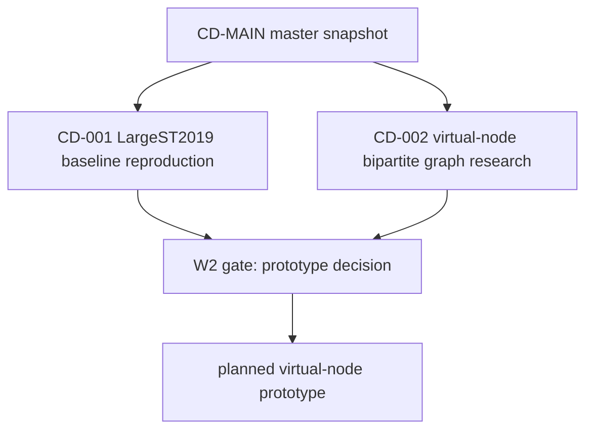

# Branch Map: LargeST 2019 Baselines and Virtual-Node Bipartite Graphs

Snapshot: `snap-2026-06-22-001`  
Owner session: `[CD-MAIN][master] LargeST2019 virtual-node benchmark`

## Global Decisions

- The dynamic-threshold direction is out of scope for this line.
- First reproduction scope is LargeST 2019 on `SD`, `GLA`, and `GBA`; `CA` is not a Wave 1 completion requirement.
- Wave 1 has two parallel branches: reproduction and literature/modeling.
- Branch completion reports are the only default merge inputs.

## Wave Plan

| Wave | Branches | Prerequisites | Gate |
|---|---|---|---|
| W0 | master scope and branch briefs | confirmed plan | branch briefs written |
| W1 | `CD-001`, `CD-002` | `snap-2026-06-22-001` | completion reports reviewed |
| W2 | virtual-node prototype decision | W1 completion reports | explicit master decision |

## Today View

Active now:

- `CD-001` LargeST2019 baselines - repro branch - STID SD running on 178; STID GLA/GBA queued on 180

Planned, not opened:

- W2 virtual-node prototype implementation - waits for W1 reports

Merge pending:

- `CD-002` Virtual-node bipartite graph - completion suggested; waiting for user-confirmed merge

## Branch Registry

| ID | Stable title | Type | Role | State | Wave | Brief | Completion report |
|---|---|---|---|---|---|---|---|
| `CD-001` | `[CD-001][W1][repro] LargeST2019 baselines` | branch | reproduction | active | W1 | `CD-001_largest2019_baselines/branch-brief.md` | `CD-001_largest2019_baselines/completion-report.md` |
| `CD-002` | `[CD-002][W1][research] Virtual-node bipartite graph` | branch | research | completion_suggested | W1 | `CD-002_virtual_node_bipartite/branch-brief.md` | `CD-002_virtual_node_bipartite/completion-report.md` |

## Dependency Graph

